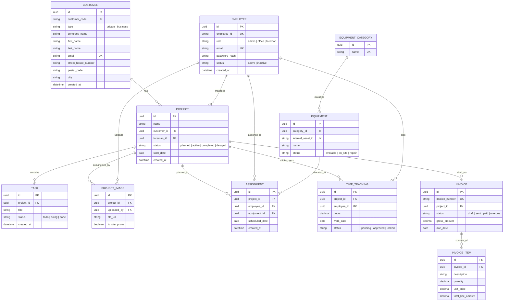

---

## Indexing & Performance Optimization

To ensure system scalability and demonstrate professional architectural standards, the following indexing strategy will be implemented:

### 1. Business Logic & Unique Constraints
- Integrity: `customer_code`, `employee_id`, `email`, and `invoice_number` are assigned **Unique B-Tree Indexes**. This ensures data integrity and speeds up lookups for master data.

### 2. Foreign Key Optimization (Joins)
- Relational INdexes: All Foreign Key columns (e.g., `project_id`, `customer_id`) will be explicitly indexed.
- Benefit: Since PostgreSQL does not index FKs by default, these indexes prevent full-table scans during complex joins (e.g., fetching all invoices for a specific customer).

### 3. Conflict Prevention (Composite Indexes)
- Resource Planning: Composite indexes on `ASSIGNMENT (scheduled_date, employee_id)` and `ASSIGNMENT (scheduled_date, equipment_id)`.
- Benefit: Enables high-performance, real-time validation to prevent double-booking of staff or machinery during the planning process.