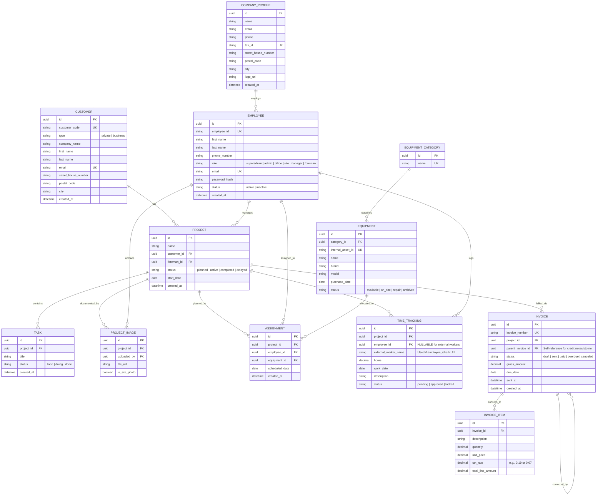

```mermaid
erDiagram
    COMPANY_PROFILE ||--o{ EMPLOYEE : "employs"
    CUSTOMER ||--o{ PROJECT : "has"
    PROJECT ||--o{ TASK : "contains"
    PROJECT ||--o{ PROJECT_IMAGE : "documented_by"
    PROJECT ||--o{ ASSIGNMENT : "planned_in"
    PROJECT ||--o{ TIME_TRACKING : "tracks_hours"
    PROJECT ||--o{ INVOICE : "billed_via"
    
    EMPLOYEE ||--o{ PROJECT : "manages"
    EMPLOYEE ||--o{ ASSIGNMENT : "assigned_to"
    EMPLOYEE ||--o{ TIME_TRACKING : "logs"
    EMPLOYEE ||--o{ PROJECT_IMAGE : "uploads"
    
    EQUIPMENT_CATEGORY ||--o{ EQUIPMENT : "classifies"
    EQUIPMENT ||--o{ ASSIGNMENT : "allocated_to"
    
    INVOICE ||--o{ INVOICE_ITEM : "consists_of"
    INVOICE ||--o{ INVOICE : "corrected_by"

    COMPANY_PROFILE {
        uuid id PK
        string name
        string email
        string phone
        string tax_id UK
        string street_house_number
        string postal_code
        string city
        string logo_url
        datetime created_at
    }

    CUSTOMER {
        uuid id PK
        string customer_code UK
        string type "private | business"
        string company_name
        string first_name
        string last_name
        string email UK
        string street_house_number
        string postal_code
        string city
        datetime created_at
    }

    EMPLOYEE {
        uuid id PK
        string employee_id UK
        string first_name
        string last_name
        string phone_number
        string role "superadmin | admin | office | site_manager | foreman"
        string email UK
        string password_hash
        string status "active | inactive"
        datetime created_at
    }

    PROJECT {
        uuid id PK
        string name
        uuid customer_id FK
        uuid foreman_id FK
        string status "planned | active | completed | delayed"
        date start_date
        datetime created_at
    }

    TASK {
        uuid id PK
        uuid project_id FK
        string title
        string status "todo | doing | done"
        datetime created_at
    }

    EQUIPMENT_CATEGORY {
        uuid id PK
        string name UK
    }

    EQUIPMENT {
        uuid id PK
        uuid category_id FK
        string internal_asset_id UK
        string name
        string brand
        string model
        date purchase_date
        string status "available | on_site | repair | archived"
    }

    ASSIGNMENT {
        uuid id PK
        uuid project_id FK
        uuid employee_id FK
        uuid equipment_id FK
        date scheduled_date
        datetime created_at
    }

    TIME_TRACKING {
        uuid id PK
        uuid project_id FK
        uuid employee_id FK "NULLABLE for external workers"
        string external_worker_name "Used if employee_id is NULL"
        decimal hours
        date work_date
        string description
        string status "pending | approved | locked"
    }

    PROJECT_IMAGE {
        uuid id PK
        uuid project_id FK
        uuid uploaded_by FK
        string file_url
        boolean is_site_photo
    }

    INVOICE {
        uuid id PK
        string invoice_number UK
        uuid project_id FK
        uuid parent_invoice_id FK "Self-reference for credit notes/storno"
        string status "draft | sent | paid | overdue | canceled"
        decimal gross_amount
        date due_date
        datetime sent_at
        datetime created_at
    }

    INVOICE_ITEM {
        uuid id PK
        uuid invoice_id FK
        string description
        decimal quantity
        decimal unit_price
        decimal tax_rate "e.g., 0.19 or 0.07"
        decimal total_line_amount
    }
```

---

## Indexing & Performance Optimization

### 1. Business Logic & Unique Constraints
* **Company & Identity**: The fields `tax_id` (Company), `customer_code`, `employee_id`, `email`, and `invoice_number` are assigned **Unique B-Tree Indexes**. This ensures data integrity and drastically speeds up master data lookups.
* **Asset Management**: `internal_asset_id` is defined as `UNIQUE` to prevent duplicate registration of machinery and equipment.

### 2. Foreign Key Optimization (Joins)
* **Relational Indexes**: All Foreign Key columns (e.g., `project_id`, `customer_id`, `category_id`) are explicitly indexed.
* **Benefit**: Since most SQL databases (like PostgreSQL) do not index Foreign Keys by default, these indexes prevent expensive full-table scans during joins (e.g., fetching all invoices for a specific project).

### 3. Conflict Prevention & Filtering
* **Resource Planning**: Composite indexes on `ASSIGNMENT (scheduled_date, employee_id)` and `ASSIGNMENT (scheduled_date, equipment_id)`.
* **Benefit**: Enables high-performance, real-time validation to prevent double-booking of staff or machinery for the same time slot.
* **Time Logs**: An index on `TIME_TRACKING (work_date, project_id)` speeds up payroll processing and project cost calculations.
* **Invoicing**: An index on `INVOICE (parent_invoice_id)` ensures the relationship between credit notes/storno documents and original invoices is instantly resolvable.

### 4. Search Optimization
* **Customer Lookup**: A **GIN index** (for full-text search) or a prefix-based **B-Tree index** on `CUSTOMER (company_name, last_name)` is implemented to ensure a smooth "search-as-you-type" experience in the UI.